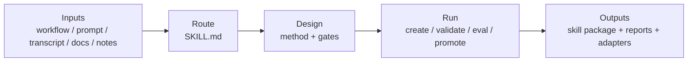

# Yao Meta Skill

[](https://github.com/yaojingang/yao-meta-skill/actions/workflows/test.yml)
[](LICENSE)
[](README.md)
[](docs/README.zh-CN.md)
[](docs/README.ja-JP.md)
[](docs/README.fr-FR.md)
[](docs/README.ru-RU.md)

`YAO` stands for `Yielding AI Outcomes` — the goal is not to generate more prompt text, but to produce reusable AI assets and real operational outcomes.

`yao-meta-skill` is a lightweight but rigorous system for creating, evaluating, packaging, and governing reusable agent skills.

[Quick Start](#quick-start) · [Examples](examples/README.md) · [Evals](evals/README.md) · [Failure Library](failures/README.md) · [Method Doctrine](#method-doctrine)

It turns rough workflows, transcripts, prompts, notes, and runbooks into reusable skill packages with:

- a clear trigger surface
- a lean `SKILL.md`
- optional references, scripts, and evals
- a front-loaded intent dialogue with an intent confidence gate, so the system keeps clarifying when the true job, outputs, exclusions, or standards are still fuzzy
- a silent-by-default GitHub benchmark scan plus reference synthesis that studies top public repositories and world-class pattern tracks, then surfaces only real conflicts or uncertainty to the user
- a generated visual HTML overview for each newly initialized skill
- a side-by-side HTML review studio for first-pass human review
- three high-value next iteration directions after the first package is created
- a lightweight feedback log that does not require a full promotion cycle
- a baseline compare report for with-skill vs baseline review
- a conversation-style, archetype-aware quickstart that steers new packages toward scaffold, production, library, or governed fits
- neutral source metadata plus client-specific adapters
- governance, promotion, and portability checks built into the default flow

## Architecture

Hero view: turn messy operational input into a governed, reusable skill package through one compact flow.



Read it in 10 seconds:

- **Inputs**: start from rough operational material.
- **Route**: define boundary and trigger in a lean `SKILL.md`.
- **Design**: choose the right archetype, gates, and resource split.
- **Run**: use the unified CLI to build, validate, optimize, and promote.
- **Outputs**: ship a reusable skill plus evidence, governance signals, and portability artifacts.

## Weighted Quality Benchmark

This benchmark is a project-level engineering review, scored from `0-10` per dimension and weighted to `100`. GitHub stars are intentionally excluded because they measure ecosystem heat, not meta-skill engineering quality.

Weighted score formula: `sum(score / 10 * weight)`.

| Meta Skill | Method Depth 15 | Context Discipline 10 | Toolchain 15 | Eval/Test Rigor 20 | Governance 15 | Portability 10 | Onboarding/Review 5 | Local Reliability 10 | Weighted Score |
| --- | ---: | ---: | ---: | ---: | ---: | ---: | ---: | ---: | ---: |
| Yao Meta Skill | 9.5 | 8.0 | 9.5 | 9.5 | 9.5 | 9.0 | 6.5 | 9.5 | 91.5 |
| Anthropic Skill Creator | 9.0 | 6.5 | 8.5 | 7.5 | 4.0 | 5.0 | 7.5 | 5.0 | 67.5 |
| OpenAI Skill Creator | 8.5 | 9.5 | 5.0 | 2.0 | 3.0 | 4.0 | 8.5 | 4.0 | 50.5 |

| Rank | Meta Skill | Score | Core Positioning |
| ---: | --- | ---: | --- |
| 1 | Yao Meta Skill | 91.5 | A complete engineering, evaluation, governance, and portability system for reusable skills. |
| 2 | Anthropic Skill Creator | 67.5 | Strong methodology and iteration loop, with weaker local execution reliability and governance coverage. |
| 3 | OpenAI Skill Creator | 50.5 | Best treated as a concise skill-writing method guide rather than a full engineering system. |

## Best-Fit Scenarios

- Choose **Yao Meta Skill** when the target is a reusable team asset with explicit boundaries, trigger evaluation, governance, packaging, portability, and local execution checks.
- Choose **Anthropic Skill Creator** when the target is a conversation-first creation loop and the priority is human-guided iteration over repository-level governance.
- Choose **OpenAI Skill Creator** when the target is a compact reference for writing lean skill instructions and keeping context small.
- A practical hybrid pattern is still useful: draft conversationally, then use `yao-meta-skill` to harden the package, add evidence, and make it team-ready.

## Quick Start

1. Describe the workflow, prompt set, or repeated task you want to turn into a skill.
2. Start with a short, human intent dialogue so the real job, outputs, exclusions, constraints, and standards are explicit.
3. Let `quickstart` clarify intent first, then run silent benchmark scan and reference synthesis; it only surfaces explicit questions when intent is still unclear or when there is a real design conflict.
4. Use the archetype-aware `quickstart` or the full authoring flow to generate or improve the package in scaffold, production, library, or governed mode.
5. Review the generated `reports/intent-dialogue.md`, `reports/intent-confidence.md`, `reports/reference-synthesis.md`, `reports/skill-overview.html`, and `reports/iteration-directions.md` before adding more structure.

Or use the unified authoring CLI:

```bash
python3 scripts/yao.py quickstart --output-dir .
python3 scripts/yao.py github-benchmark-scan my-skill --query "release workflow portability"
python3 scripts/yao.py reference-scan my-skill \
  --external-reference "World Class Method::method::Borrow a tight evaluation loop.::Do not copy heavy process." \
  --user-reference "A product or repo I admire::taste::Learn the clarity and operating standard.::Do not copy wording." \
  --local-constraint "Current Library Naming::structure::Keep naming aligned with the local skill library.::Do not inherit private references."
python3 scripts/yao.py review-viewer my-skill
python3 scripts/yao.py feedback my-skill --note "Tighten exclusions before adding scripts." --rating 4 --category boundary
python3 scripts/yao.py baseline-compare
python3 scripts/yao.py package . --platform generic --output-dir dist
```

## 5-Minute Workflow

1. Start from a raw workflow note.
2. Turn it into a skill package with `SKILL.md`, `agents/interface.yaml`, and only the folders the workflow actually needs.
3. Validate the trigger description with `evals/trigger_cases.json`.
4. Export compatibility artifacts for the clients you care about.
5. Compare the result against the examples in `examples/`.

Minimum commands:

```bash
python3 scripts/trigger_eval.py --description-file evals/improved_description.txt --cases evals/trigger_cases.json
python3 scripts/run_description_optimization_suite.py
python3 scripts/judge_blind_eval.py --description-file SKILL.md --cases evals/blind_holdout/trigger_cases.json --semantic-config evals/semantic_config.json
python3 scripts/context_sizer.py .
python3 scripts/resource_boundary_check.py .
python3 scripts/governance_check.py . --require-manifest
python3 scripts/cross_packager.py . --platform openai --platform claude --platform generic --expectations evals/packaging_expectations.json --zip
python3 tests/verify_packager_failures.py
```

Or run everything together:

```bash
make test
```

Unified authoring flow:

```bash
python3 scripts/yao.py init my-skill --description "Describe what the skill does."
python3 scripts/yao.py validate my-skill
python3 scripts/yao.py workspace-flow --target root --label first-pass
python3 scripts/yao.py review-viewer my-skill
python3 scripts/yao.py review --target root
python3 scripts/yao.py release-snapshot --target root --label release-candidate
python3 scripts/yao.py package . --platform openai --platform claude --platform generic --output-dir dist --zip
python3 scripts/yao.py test
```

## Results

The homepage panel below is generated from the current eval suite so the family-level outcome is visible without opening raw JSON.

<!-- BEGIN:EVAL_RESULTS -->
- regression corpus: `66` prompts across `21` families
- aggregate result: `0` false positives, `0` false negatives, average precision `1.0`, average recall `1.0`
- suite status:

| Suite | Cases | FP | FN | Precision | Recall |
| --- | ---: | ---: | ---: | ---: | ---: |
| train | 31 | 0 | 0 | 1.0 | 1.0 |
| dev | 22 | 0 | 0 | 1.0 | 1.0 |
| holdout | 13 | 0 | 0 | 1.0 | 1.0 |

| Family | Cases | Pass Rate |
| --- | ---: | ---: |
| `brainstorm_only` | 2 | 1.0 |
| `brainstorm_vs_build` | 1 | 1.0 |
| `complex_multi_asset` | 3 | 1.0 |
| `document_export_vs_agent_skill` | 4 | 1.0 |
| `document_only` | 3 | 1.0 |
| `explain_not_package` | 1 | 1.0 |
| `explain_only` | 5 | 1.0 |
| `future_outline_vs_build` | 4 | 1.0 |
| `iterate_existing_skill` | 5 | 1.0 |
| `long_context_document_only` | 3 | 1.0 |
| `long_context_near_neighbor` | 3 | 1.0 |
| `long_context_summary_only` | 2 | 1.0 |
| `long_context_trigger` | 4 | 1.0 |
| `meta_skill_creation` | 1 | 1.0 |
| `one_off_vs_reusable` | 2 | 1.0 |
| `package_for_team` | 2 | 1.0 |
| `paraphrase_trigger` | 5 | 1.0 |
| `partial_scaffold_not_full_skill` | 4 | 1.0 |
| `summary_only` | 3 | 1.0 |
| `translate_only` | 4 | 1.0 |
| `workflow_to_skill` | 5 | 1.0 |

Full reports: [reports/eval_suite.json](reports/eval_suite.json) and [reports/family_summary.md](reports/family_summary.md)
<!-- END:EVAL_RESULTS -->

- packaging validation: `openai`, `claude`, and `generic` targets pass contract checks
- portability score: `100/100` with neutral activation, execution, trust, and degradation metadata preserved across all exported targets
- description optimization suite: root, team frontend review, and governed incident command pass blind and adversarial holdout gates; governed incident command still carries one visible holdout miss, and adversarial calibration plus family drift are now tracked separately
- judge-backed blind eval: root, team frontend review, and governed incident command now pass an independent rubric judge on blind holdout prompts
- packaging failure fixtures: invalid metadata, invalid YAML, and unsupported targets fail as expected
- failure library regressions: anti-pattern families pass automated checks
- governance and resource-boundary checks are part of the default test path
- root governance maturity score: `90/100`; governed benchmark example: `95/100`
- CJK-aware trigger matching is now covered by explicit Chinese build, packaging, eval, and near-neighbor cases
- context budgets: root `994/1000`, complex benchmark `790/1000`, governed benchmark `760/1000`
- quality density: root `130.8`, complex benchmark `164.6`, governed benchmark `171.1`
- regression milestones are tracked in [reports/regression_history.md](reports/regression_history.md)
- description drift history is tracked in [reports/description_drift_history.md](reports/description_drift_history.md)
- route confusion is tracked in [reports/route_scorecard.md](reports/route_scorecard.md)
- promotion evidence is summarized in [reports/iteration_ledger.md](reports/iteration_ledger.md)
- promotion decisions are published in [reports/promotion_decisions.md](reports/promotion_decisions.md)
- candidate lifecycle states are published in [reports/candidate_registry.md](reports/candidate_registry.md)
- lightweight with-skill vs baseline comparison is published in [reports/baseline-compare.md](reports/baseline-compare.md)
- context budget summaries are tracked in [reports/context_budget.md](reports/context_budget.md)
- portability status is tracked in [reports/portability_score.md](reports/portability_score.md)

## Current Strengths

The latest weighted review puts Yao at `91.5/100`. The strongest dimensions are the ones that matter most when skills become long-lived team assets:

- **Method depth `9.5`**: formal skill engineering doctrine, archetypes, gate selection, non-skill decisions, lifecycle governance, and resource boundaries.
- **Toolchain completeness `9.5`**: authoring, validation, benchmark scan, description optimization, report generation, promotion checks, packaging, CI, and portability checks are wired into one operational flow.
- **Eval and test rigor `9.5`**: trigger quality is checked with train/dev/holdout, blind holdout, adversarial holdout, judge-backed blind eval, route confusion, drift history, and promotion gates.
- **Governance and lifecycle `9.5`**: important skills can carry owner, lifecycle state, review cadence, maturity score, trust boundaries, promotion decisions, and regression history.
- **Local execution reliability `9.5`**: the repository is executable locally through `make test`, `make ci-test`, and the unified `scripts/yao.py` authoring CLI.
- **Portability and distribution `9.0`**: neutral source metadata, client adapters, degradation rules, packaging contracts, and portability scoring preserve reusable semantics across target environments.
- **Context discipline `8.0`**: the entrypoint is still held under budget, but this is tracked as a live constraint because the system now carries more reports, examples, benchmark assets, and generated evidence.
- **Onboarding and review experience `6.5`**: quickstart, HTML overview, side-by-side review viewer, and feedback logs have improved the first-run experience, but this remains the clearest UX improvement area.

The current direction is deliberate: keep the entrypoint light, make evaluation hard to fake, make governance visible, and continue reducing the friction of first-time creation and review.

## Why Yao

- **Lightweight**: the entrypoint stays compact, context budgets are explicit, and extra structure is added only when it pays for itself.
- **Rigorous**: trigger quality is checked with family regressions, blind holdout, adversarial holdout, route confusion, judge-backed blind eval, and promotion gates.
- **Governed**: important skills are treated as maintainable assets with lifecycle state, maturity expectations, ownership, and review cadence.
- **Portable**: source metadata stays neutral while adapters, degradation rules, and packaging contracts preserve reusable semantics across environments.

## What It Does

This project helps you create, refactor, evaluate, and package skills as durable capability bundles rather than one-off prompts.

The design logic is simple:

1. Capture the real recurring job behind the user's request.
2. Set a clean skill boundary so one package does one coherent job.
3. Optimize the trigger description before over-writing the body.
4. Keep the main skill file small and move details into references or scripts.
5. Add quality gates only when they pay for themselves.
6. Export compatibility artifacts only for the clients you actually need.

## Method Doctrine

The repository now treats method as a first-class asset instead of scattered guidance.

- [Skill Engineering Method](references/skill-engineering-method.md)
- [Intent Dialogue](references/intent-dialogue.md)
- [Reference Scan Strategy](references/reference-scan.md)
- [Authoring Discipline](references/authoring-discipline.md)
- [Skill Archetypes](references/skill-archetypes.md)
- [Gate Selection](references/gate-selection.md)
- [Iteration Philosophy](references/iteration-philosophy.md)
- [Non-Skill Decision Tree](references/non-skill-decision-tree.md)
- [Regression Cause Taxonomy](references/regression-cause-taxonomy.md)
- [Human Review Template](references/human-review-template.md)

## Why It Exists

Most teams keep valuable operating knowledge scattered across chats, personal prompts, oral habits, and undocumented workflows. This project converts that hidden process knowledge into:

- discoverable skill packages
- repeatable execution flows
- lower-context instructions
- reusable team assets
- compatibility-ready distributions

## Repository Structure

```text
yao-meta-skill/
├── SKILL.md
├── README.md
├── LICENSE
├── .gitignore
├── agents/
│   └── interface.yaml
├── evals/
├── examples/
├── references/
├── scripts/
└── templates/
```

## Core Components

### `SKILL.md`

The main skill entrypoint. It defines the trigger surface, operating modes, compact workflow, and output contract.

### `agents/interface.yaml`

The neutral metadata source of truth. It stores display and compatibility metadata without locking the source tree to one vendor-specific path.

### `references/`

Long-form material that should not bloat the main skill file. This includes design rules, evaluation guidance, compatibility strategy, and quality rubrics.

### `scripts/`

Utility scripts that make the meta-skill operational:

- `trigger_eval.py`: evaluates trigger descriptions with semantic intent concepts, explicit exclusions, and near-neighbor prompts
- `run_eval_suite.py`: runs train/dev/holdout trigger suites, reports family-level regressions, and fails if aggregate regressions appear
- `optimize_description.py`: generates candidate descriptions, scores them on dev, visible holdout, blind holdout, and adversarial holdout suites, then reports calibration and family health
- `judge_blind_eval.py`: applies an independent rubric judge to blind-holdout prompts so blind acceptance is not backed only by the main threshold scorer
- `run_description_optimization_suite.py`: runs description optimization across the root skill and governed examples, then writes reusable reports and optional drift snapshots with calibration and family summaries
- `promotion_checker.py`: applies promotion policy to current description candidates, writes promotion decisions, builds candidate registries, and emits iteration bundles with review stubs
- `create_iteration_snapshot.py`: freezes the current promotion decision into a versioned release snapshot with review, route, and context evidence
- `yao.py`: unified authoring CLI that exposes init, validate, optimize-description, promote-check, review, release-snapshot, workspace-flow, report, package, and test as one entrypoint
- `render_description_drift_history.py`: turns description-optimization snapshots into a readable drift-history report
- `build_confusion_matrix.py`: scores route confusion across tracked sibling skills and `no_route` cases, then writes a route scorecard and optional milestone snapshot
- `render_iteration_ledger.py`: compresses regression milestones, description optimization drift, and route scorecards into one iteration-facing ledger
- `context_sizer.py`: estimates context weight and warns when the initial load gets too large
- `resource_boundary_check.py`: audits whether detail is split across `SKILL.md`, `references/`, `scripts/`, `assets/`, and `evals/` appropriately
- `governance_check.py`: validates owner, review cadence, lifecycle stage, and maturity metadata
- `render_context_reports.py`: generates root and example context-budget reports plus a shared context summary
- `render_regression_history.py`: turns milestone snapshots into a readable regression history report
- `cross_packager.py`: builds client-specific export artifacts with explicit platform contracts and validation
- `render_portability_report.py`: scores cross-environment portability from neutral metadata, degradation rules, and consumer validation coverage
- `init_skill.py`, `lint_skill.py`, `validate_skill.py`, `diff_eval.py`: minimal authoring toolchain

### `evals/`

Reusable trigger and packaging checks, including baseline and improved descriptions for comparison plus the root semantic configuration that drives description optimization.

This directory also contains route confusion fixtures and promotion policy rules for deciding when a route is promotable.

### `examples/`

End-to-end examples showing raw workflow input, design summary, final generated skill shape, and targeted description-optimization packs where route wording is tuned against example-specific dev and holdout cases.

### `.github/workflows/test.yml`

Continuous integration entrypoint that runs the full local regression suite on push and pull request.

## Validation Notes

- Trigger evaluation now uses a local semantic-intent model with explicit positive concepts, exclusion concepts, and boundary-case reporting.
- The sample trigger report now covers a larger positive, negative, and near-neighbor set rather than a tiny demo set.
- Train/dev/holdout trigger suites now separate iterative tuning from final verification.
- Description optimization now uses dev for ranking, visible holdout for non-regression, blind holdout for acceptance, and adversarial holdout for harder route-collision checks without feeding the ranking loop.
- Judge-backed blind eval now adds a rubric-based second opinion for blind prompts, so blind acceptance is not decided by one scorer alone.
- Description drift history now records adversarial calibration gaps and family coverage, so routing changes can be judged on confidence and family stability rather than raw error counts alone.
- Route confusion is now tracked explicitly across the root meta-skill, frontend review skill, governed incident skill, and `no_route` cases, so route theft is visible instead of implicit.
- Promotion policy now requires visible holdout, blind holdout, adversarial holdout, and route confusion to stay clean before a description should be considered promotable.
- Promotion checking now emits explicit decisions, candidate lifecycle states, iteration bundles, and human-review stubs rather than leaving promotion as a prose-only step.
- Promotion decisions now distinguish “no candidate beat current” from “current still has residual route risk,” so iteration can be audited without forcing every issue into a false block.
- Packaging validation now uses explicit contracts and YAML parsing, but it is still a lightweight local validation layer rather than a full platform integration suite.
- `evals/failure-cases.md` captures known weak spots that should remain part of regression checks.
- `failures/` captures reusable anti-pattern writeups and machine-runnable failure cases for routing, packaging, and authoring failures.
- `tests/verify_packager_failures.py` checks that invalid metadata, invalid YAML, and unsupported targets fail clearly.
- Governance metadata and resource-boundary rules now have runnable checks instead of staying as prose only.
- Governance checks now emit a maturity score so governed assets can be compared instead of only pass/fail checked.
- Description optimization drift history is now versioned separately from the main trigger regression history so routing improvements are visible over time.
- Iteration evidence now records why a candidate was kept, blocked, or promotable via a shared regression-cause taxonomy and bundle artifacts.
- Declared maturity tiers are checked against recommended minimum governance scores, so `production`, `library`, and `governed` assets can be compared without forcing every strong example into the same label.
- Context budgets are now tiered and explicit, so a governed skill can still choose a stricter `production`-sized initial-load budget.
- Resource-boundary checks now detect decorative directories and compute a local quality-density signal instead of only checking raw token counts.

### `templates/`

Starter templates for simple and more advanced skill packages.

## How To Use

### 1. Use the skill directly

Invoke `yao-meta-skill` when you want to:

- create a new skill
- improve an existing skill
- add evals to a skill
- convert a workflow into a reusable package
- prepare a skill for wider team adoption

### 2. Generate a new skill package

The typical flow is:

1. describe the workflow or capability
2. identify trigger phrases and outputs
3. choose scaffold, production, or library mode
4. generate the package
5. run the sizing and trigger checks if needed
6. export target-specific compatibility artifacts

### 3. Export compatibility artifacts

Examples:

```bash
python3 scripts/cross_packager.py ./yao-meta-skill --platform openai --platform claude --expectations evals/packaging_expectations.json --zip
python3 scripts/context_sizer.py ./yao-meta-skill
python3 scripts/resource_boundary_check.py ./yao-meta-skill
python3 scripts/governance_check.py ./yao-meta-skill --require-manifest
python3 scripts/trigger_eval.py --description-file evals/improved_description.txt --cases evals/trigger_cases.json --baseline-description-file evals/baseline_description.txt
```

## Advantages

- **Method-first, not prompt-first**: skill creation is treated as a formal engineering workflow with archetypes, gate selection, and non-skill decisions.
- **Trigger-aware by design**: descriptions are optimized with route confusion, blind holdout, adversarial families, and promotion policy instead of one-shot intuition.
- **Lightweight at the entrypoint**: `SKILL.md` stays compact while references, scripts, and evals are only added when they pay for themselves.
- **Toolchain-backed**: initialization, validation, optimization, reporting, packaging, and testing are available through one unified CLI and CI path.
- **Governed as an asset**: important skills can carry ownership, lifecycle state, maturity expectations, and review cadence.
- **Portable by default**: source metadata stays neutral while adapters and degradation rules preserve compatibility across target environments.
- **Evidence-rich**: route scorecards, regression history, context budgets, portability scores, and promotion decisions are published as artifacts instead of hidden implementation detail.

## Best Fit

This project is best for:

- agent builders
- internal tooling teams
- prompt engineers moving toward structured skills
- organizations building reusable skill libraries

## Documentation

| Language | Entry |
| --- | --- |
| English | [README.md](README.md) |
| 中文 | [docs/README.zh-CN.md](docs/README.zh-CN.md) |
| 日本語 | [docs/README.ja-JP.md](docs/README.ja-JP.md) |
| Français | [docs/README.fr-FR.md](docs/README.fr-FR.md) |
| Русский | [docs/README.ru-RU.md](docs/README.ru-RU.md) |

## Examples And Evals

- Examples: [examples/README.md](examples/README.md)
- Evals: [evals/README.md](evals/README.md)
- Failure library: [failures/README.md](failures/README.md)
- Failure regression check: [verify_failure_regressions.py](tests/verify_failure_regressions.py)
- Regression history: [reports/regression_history.md](reports/regression_history.md)
- Root governance score: [reports/governance_score.json](reports/governance_score.json)
- Packaging contracts: [references/packaging-contracts.md](references/packaging-contracts.md)
- Governance model: [references/governance.md](references/governance.md)
- Resource boundary spec: [references/resource-boundaries.md](references/resource-boundaries.md)
- Platform capability matrix: [references/platform-capability-matrix.md](references/platform-capability-matrix.md)
- Failure fixtures: [tests/fixtures](tests/fixtures)
- Adapter snapshots: [tests/snapshots](tests/snapshots)
- Evolution example: [examples/evolution-frontend-review/README.md](examples/evolution-frontend-review/README.md)
- Governed example: [examples/governed-incident-command/design-summary.md](examples/governed-incident-command/design-summary.md)
- Governed example score: [examples/governed-incident-command/generated-skill/reports/governance_score.json](examples/governed-incident-command/generated-skill/reports/governance_score.json)

## License

MIT. See [LICENSE](LICENSE).
