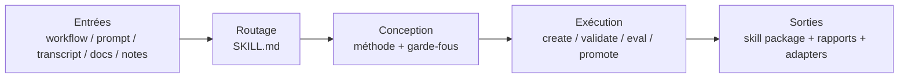

# Présentation de Yao Meta Skill

`YAO = Yielding AI Outcomes` signifie produire de vrais résultats grâce à l'IA. L'objectif n'est pas d'écrire davantage de texte de prompt, mais de livrer des actifs IA réutilisables et des résultats opérationnels concrets.

`yao-meta-skill` est un système léger mais rigoureux pour créer, évaluer, empaqueter et gouverner des agent skills réutilisables.

Il transforme des workflows bruts, des transcripts, des prompts, des notes et des runbooks en paquets de skills réutilisables avec :

- une surface de déclenchement claire
- un `SKILL.md` léger
- des references, scripts et evals optionnels
- un court dialogue d'intention avant l'authoring approfondi
- un benchmark/reference scan contrôlé avant l'authoring profond
- un rapport HTML minimaliste en fond blanc généré automatiquement pour chaque nouveau skill
- trois directions d'itération à plus forte valeur après la première création
- des métadonnées sources neutres et des adaptateurs spécifiques au client
- des contrôles de gouvernance, de promotion et de portabilité intégrés au flux standard

## Architecture

En version hero, le système tient sur une seule ligne : transformer une entrée brouillonne en skill package gouverné et réutilisable.



Lecture en 10 secondes :

- **Entrées** : on part de workflows, prompts, documents et notes dispersés.
- **Routage** : un `SKILL.md` léger définit d'abord la frontière et le déclenchement.
- **Conception** : on choisit le bon archetype, les bons gates et la bonne séparation des ressources.
- **Exécution** : la CLI unifiée construit, valide, optimise et promeut le skill.
- **Sorties** : on obtient un skill package réutilisable avec ses preuves d'évaluation, de gouvernance et de portabilité.

## Comparatif rapide

Le tableau ci-dessous est un benchmark orienté scénario. Il aide à choisir le bon système selon le contexte, plutôt qu'à prétendre qu'une approche domine toutes les autres dans tous les cas.

| Dimension | skill-creator | yao-meta-skill | Ce que cela signifie |
| --- | ---: | ---: | --- |
| Facilité de prise en main | 9 | 6 | `skill-creator` est plus conversationnel et intuitif ; `yao-meta-skill` demande plus d'apprentissage. |
| Flexibilité | 9 | 7 | `skill-creator` est plus libre ; `yao-meta-skill` suit un processus plus explicite. |
| Profondeur méthodologique | 5 | 9.5 | `yao-meta-skill` possède une doctrine plus complète : archetypes, gates, governance et resource boundaries. |
| Rigueur d'évaluation | 7 | 9.5 | `yao-meta-skill` insiste sur les holdouts multiples, la route confusion, l'adversarial et les promotion gates. |
| Expérience de revue humaine | 9 | 5 | `skill-creator` offre une expérience de revue plus directe ; `yao-meta-skill` reste surtout piloté par des rapports. |
| Gouvernance et cycle de vie | 2 | 9.5 | `yao-meta-skill` traite les skills importantes comme des actifs gérés avec maturité, cadence de revue et preuves de promotion. |
| Portabilité inter-environnements | 4 | 9 | `yao-meta-skill` repose sur des métadonnées neutres, des adaptateurs, des règles de dégradation et des contrôles de portabilité. |
| Complétude de la toolchain | 6 | 9.5 | `yao-meta-skill` apporte une toolchain plus large avec CLI unifiée, CI et génération de rapports. |
| Vitesse d'itération | 8 | 7 | `skill-creator` paraît plus rapide pour les petites boucles ; `yao-meta-skill` accepte plus de friction pour gagner en preuves. |
| Qualité de la documentation | 7 | 9 | `yao-meta-skill` fournit docs multilingues, exemples, failure library et méthode formalisée. |
| Pertinence pour un usage individuel | 9 | 6 | `skill-creator` est plus naturel pour un usage personnel rapide. |
| Pertinence pour une équipe / organisation | 5 | 9.5 | `yao-meta-skill` est mieux adapté à la réutilisation en équipe, à la CI, à la gouvernance et à la maintenance longue. |
| Global | 6.7 | 8.0 | Le compromis est clair : flux conversationnel léger d'un côté, ingénierie et gouvernance plus fortes de l'autre. |

## Scénarios recommandés

- Choisissez **skill-creator** si votre besoin principal est l'idéation rapide en solo, l'interaction souple et un processus léger.
- Choisissez **yao-meta-skill** si vous voulez un actif réutilisable avec frontières explicites, gates d'évaluation, gouvernance, portabilité et maintenance à long terme.
- Un schéma hybride utile consiste à produire un premier jet avec un creator conversationnel, puis à utiliser `yao-meta-skill` pour durcir le package et le rendre prêt pour une équipe.

## Quick Start

1. Décrivez le workflow, l'ensemble de prompts ou la tâche répétée que vous voulez transformer en skill.
2. Commencez par un court dialogue d'intention pour clarifier le vrai job, les sorties, les exclusions et les contraintes.
3. Lancez ensuite un short reference scan en privilégiant GitHub et les objets publics de référence ; les fichiers locaux ne servent ensuite qu'à l'ajustement, à la confidentialité et à la compatibilité.
4. Utilisez `yao-meta-skill` pour générer ou améliorer le paquet en mode scaffold, production ou library.
5. Chaque nouveau skill reçoit aussi `reports/intent-dialogue.md`, `reports/skill-overview.html`, `reports/reference-scan.md` et `reports/iteration-directions.md`.

## Results

- `make test` passe actuellement
- sur le jeu de régression courant, trigger eval a `0` faux positifs et `0` faux négatifs
- les suites train / dev / holdout passent toutes
- les contrats de packaging `openai`, `claude` et `generic` sont validés

## Points forts actuels

Dans la dernière revue pondérée partagée pour le projet, Yao se distingue surtout sur les dimensions qui définissent une méta-skill réellement exploitable en production :

- **Complétude méthodologique `9.8`** : le dépôt possède désormais une doctrine explicite pour le skill engineering, la sélection des gates, les non-skills, la gouvernance et les frontières de ressource.
- **Chaîne d'outillage `9.8`** : initialisation, validation, optimisation, reporting, contrôle de promotion, packaging et CI sont reliés dans un flux unique.
- **Gouvernance / maintenance / sécurité `9.8`** : les skills importantes peuvent porter un état de cycle de vie, une cadence de revue, un score de maturité, des frontières de confiance et des preuves de promotion.
- **Boucle d'évaluation `9.7`** : la qualité de déclenchement est vérifiée via train/dev/holdout, blind holdout, adversarial holdout, judge-backed blind eval, drift history et promotion gates.
- **Portabilité / packaging `9.6`** : la source reste neutre tandis que les adaptateurs, règles de dégradation et contrats de packaging préservent la sémantique réutilisable selon l'environnement cible.
- **Déclenchement et frontières `9.5`** : route confusion, régressions anti-pattern et promotion policy transforment le déclenchement en problème de routage auditable.
- **Efficacité de contexte `9.4`** : le point d'entrée reste compact, les budgets de contexte sont hiérarchisés et la densité de qualité est suivie.

La direction est volontaire : garder une entrée légère, rendre l'évaluation stricte, et traiter la gouvernance comme une partie de la qualité d'une skill.

## Pourquoi Yao

- **Léger** : le point d'entrée reste compact, les budgets de contexte sont explicites, et la structure supplémentaire n'est ajoutée que lorsqu'elle apporte une vraie valeur.
- **Rigoureux** : la qualité de déclenchement est vérifiée par family regressions, blind holdout, adversarial holdout, route confusion, judge-backed blind eval et promotion gates.
- **Gouvernable** : les skills importantes sont traitées comme des actifs maintenables avec lifecycle, attentes de maturité, ownership et cadence de revue.
- **Portable** : les métadonnées source restent neutres, tandis que les adaptateurs, règles de dégradation et contrats de packaging préservent une sémantique réutilisable entre environnements.

## Ce que fait le projet

Ce projet permet de créer, refactoriser, évaluer et empaqueter des skills comme des briques de capacité durables plutôt que comme des prompts ponctuels.

Sa logique de conception est simple :

1. identifier le vrai travail récurrent derrière la demande
2. définir une frontière propre pour que chaque paquet fasse un travail cohérent
3. optimiser la description de déclenchement avant d'allonger le corps
4. garder le fichier principal compact et déplacer le détail vers les references ou les scripts
5. ajouter des garde-fous qualité seulement lorsqu'ils sont utiles
6. exporter des artefacts de compatibilité uniquement pour les clients nécessaires

## Pourquoi ce projet existe

Dans la plupart des équipes, la connaissance opérationnelle utile est dispersée dans les chats, les prompts personnels, les habitudes orales et les workflows non documentés. Ce projet convertit cette connaissance implicite en :

- paquets de skills découvrables
- flux d'exécution répétables
- instructions à faible coût de contexte
- actifs réutilisables pour l'équipe
- distributions prêtes pour la compatibilité

## Structure du dépôt

```text
yao-meta-skill/
├── SKILL.md
├── README.md
├── LICENSE
├── .gitignore
├── agents/
│   └── interface.yaml
├── references/
├── scripts/
└── templates/
```

## Composants principaux

### `SKILL.md`

Le point d'entrée principal. Il définit la surface de déclenchement, les modes opératoires, le workflow compact et le contrat de sortie.

### `agents/interface.yaml`

La source de vérité neutre pour les métadonnées. Ce fichier stocke les informations d'affichage et de compatibilité sans lier l'arborescence source à un chemin spécifique à un fournisseur.

### `references/`

Les documents longs qui ne doivent pas gonfler le fichier principal. On y trouve les règles de conception, les guides d'évaluation, la stratégie de compatibilité et les rubriques de qualité.

### `scripts/`

Des utilitaires qui rendent la méta-skill opérationnelle :

- `trigger_eval.py` : vérifie si une description de déclenchement est trop large ou trop faible
- `context_sizer.py` : estime le poids de contexte et avertit si le chargement initial devient trop grand
- `cross_packager.py` : génère des artefacts d'export spécifiques au client à partir du paquet source neutre

### `templates/`

Des modèles de départ pour des paquets simples ou plus avancés.

## Comment l'utiliser

### 1. Utiliser directement la skill

Invoquez `yao-meta-skill` lorsque vous souhaitez :

- créer une nouvelle skill
- améliorer une skill existante
- ajouter des evals à une skill
- transformer un workflow en paquet réutilisable
- préparer une skill pour une adoption plus large dans l'équipe

### 2. Générer un nouveau paquet de skill

Le flux typique est :

1. décrire le workflow ou la capacité
2. identifier les phrases de déclenchement et les sorties attendues
3. choisir le mode scaffold, production ou library
4. générer le paquet
5. lancer les vérifications de taille et de déclenchement si nécessaire
6. exporter les artefacts de compatibilité ciblés

### 3. Exporter des artefacts de compatibilité

Exemples :

```bash
python3 scripts/cross_packager.py ./yao-meta-skill --platform openai --platform claude --zip
python3 scripts/context_sizer.py ./yao-meta-skill
python3 scripts/trigger_eval.py --description "Create and improve agent skills..." --cases ./cases.json
```

## Avantages

- **Méthode d'abord, pas prompt d'abord** : la création de skill est traitée comme un workflow d'ingénierie formel
- **Pensé pour l'optimisation du déclenchement** : les descriptions passent par route confusion, blind holdout, familles adversariales et promotion policy
- **Léger au point d'entrée** : `SKILL.md` reste compact et les references, scripts, evals ne sont ajoutés que lorsqu'ils sont utiles
- **Outillage cohérent** : initialisation, validation, optimisation, reporting, packaging et test passent par un CLI et un chemin CI unifiés
- **Gouverné comme un actif** : les skills importantes peuvent porter ownership, lifecycle, attentes de maturité et cadence de revue
- **Portable par défaut** : les sources restent neutres et la compatibilité est gérée par des adaptateurs et des règles de dégradation
- **Riche en preuves** : route scorecards, regression history, context budgets, portability scores et promotion decisions sont publiés comme artefacts

## Public idéal

Ce projet est particulièrement adapté à :

- constructeurs d'agents
- équipes d'outillage interne
- prompt engineers évoluant vers des skills structurées
- organisations construisant des bibliothèques de skills réutilisables

## Licence

MIT. Voir [LICENSE](../LICENSE).
