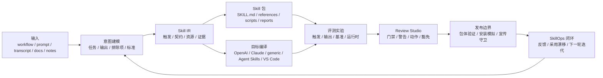

# Yao Meta Skill 中文介绍

`YAO = Yielding AI Outcomes`，中文可理解为：产出 AI 结果，交付真实成果。它强调的不是生成更多 prompt 文本，而是沉淀可复用的 AI 资产与可落地的实际结果。

`yao-meta-skill` 用来创建、评估、打包和治理可复用的 agent skill。1.0 的重点是把重复工作流整理成可安装、可阅读、可跨平台的 skill 包；2.0 进一步升级为 Skill OS，把建模、跨端编译、输出评测、评审工作台、证据账本、包体验证、发布门禁和后续迭代串成一套完整流程。

[快速开始](#快速开始) · [Skill OS 2.0 升级](#skill-os-20-升级) · [从 1.0 到 2.0](#从-10-到-20) · [加权质量评测](#加权质量评测) · [与其他元 Skill 的适用差异](#与其他元-skill-的适用差异)

## Skill OS 2.0 升级

Skill OS 2.0 保留 `yao-meta-skill` 原来的轻量入口，但把 skill 的生命周期说得更清楚。它不止生成 `SKILL.md`，还会围绕这个 skill 生成结构化契约、目标平台适配、评测证据、发布门禁和运营报告。

- **Skill IR（技能中间表示）**：用平台无关的结构记录意图、触发方式、输入输出、边界、参考资料和交付产物。
- **目标编译与适配器**：把同一份 skill 语义编译到 OpenAI、Claude、通用 agent skill、Agent Skills 兼容包和 VS Code 使用场景。
- **输出评测实验室**：覆盖触发评测、输出断言、执行证据、耗时与 token 证据、基准复现、盲评材料包、答案钥匙和评审裁决报告。
- **Review Studio 2.0（评审工作台）**：把意图、触发、输出评测、上下文成本、运行时检查、信任扫描、Skill Atlas、采用漂移、豁免、批注、发布证据、警告、阻塞项和修复动作放在同一个 HTML 页面。
- **证据与发布治理**：提供证据一致性、包体验证、安装模拟、运行时权限探测、世界级证据接收、证据账本、操作运行手册和公开宣传守卫。
- **SkillOps 闭环**：通过元数据级采用漂移、遥测 hook、自适应建议、日报/周报和组合级漂移信号，把发布后的反馈带回下一轮迭代。

当前发布口径：仓库已经适合进入测试版和外部试用，但更强的“世界级”公开宣传仍然受证据门禁约束。真实生产模型证据、真人盲评证据、原生权限执行和真实客户端遥测会继续作为独立证据任务推进，不会被包装成已经完成。

相关产物：

- [1.0 vs 2.0 可视化对比报告](../.previews/yao-meta-skill-2-comparison/index.html)
- [中文桌面预览图](../.previews/yao-meta-skill-2-comparison/yao-meta-skill-1-vs-2.png)
- [英文桌面预览图](../.previews/yao-meta-skill-2-comparison/yao-meta-skill-1-vs-2-en.png)

## 从 1.0 到 2.0

| 维度 | 1.0 重点 | 2.0 升级 |
| --- | --- | --- |
| 产品定位 | 创建、重构、评估和打包可复用 skill。 | 治理 skill 的完整生命周期：创建、编译、评测、评审、发布、遥测和迭代。 |
| 架构模型 | 以 `SKILL.md`、`agents/interface.yaml`、manifest 和报告文件为主。 | 引入 Skill IR、目标编译器、适配器、门禁契约、证据账本、发布锁和行动型评审页面。 |
| 跨端交付 | 主要覆盖 OpenAI、Claude 和通用包体。 | 扩展到 Agent Skills 兼容包和 VS Code 使用场景，并把兼容结果写入 registry 可读记录。 |
| 质量模型 | 触发、结构和报告式评审。 | 输出评测、基准复现、执行证据、失败披露、盲评材料包和证据一致性检查。 |
| 报告体验 | 概览 HTML 和首次评审页面。 | 双语 Skill Overview v2、Review Studio 2.0、评审批注、行动卡片、图表和审计型报告契约。 |
| 发布边界 | 能生成包体并做基础校验。 | 包体验证、安装模拟、运行时权限探测、发布锁、公开宣传守卫和操作运行手册。 |
| 运营闭环 | 更多依赖手动反馈和本地迭代。 | 采用漂移、元数据遥测、SkillOps 报告、自适应建议和组合级漂移检测。 |

## 2.0 使用场景

- **从重复工作创建新 skill**：从 workflow 笔记、prompt 集合、转录、runbook 或文档模式出发，生成精简入口、明确输入输出、参考资料、报告和最轻量的必要门禁。
- **把个人 skill 升级成团队资产**：补齐接口契约、manifest、目标适配器、信任检查、输出评测、评审豁免、发布说明和 Review Studio 证据，再交给多人复用。
- **准备测试版发布**：运行包体验证、安装模拟、兼容检查、运行时权限探测和证据一致性检查，把测试版就绪和更强公开声明分开处理。
- **发布后继续迭代**：用元数据级遥测、采用漂移、feedback log、SkillOps 报告和自适应建议判断下一步是补文档、补 eval、改 skill，还是调整治理规则。
- **与其他元 skill 搭配使用**：保留 Anthropic/OpenAI 式对话创建和精简写作方法的优势，在需要证据、可移植性、发布门禁和长期维护时用 `yao-meta-skill` 加固。

## 能力面

它把粗糙的 workflow、transcript、prompt、notes 和 runbook 转成可复用的 skill 包，并具备：

- 清晰的触发面
- 精简的 `SKILL.md`
- 可选的 references、scripts 和 evals
- 深度起草前先做一轮更有人味的意图对话，并通过 intent confidence gate 判断理解是否足够清楚；如果不够清楚，会继续补 1 到 2 个高杠杆问题
- 深度起草前会静默执行 GitHub benchmark scan 和 reference synthesis，优先学习高质量公开项目与世界级模式；只有遇到真实冲突或不确定性时才显式抬给用户
- 会主动询问用户是否有希望借鉴的参考对象，只学习其中的模式抽象、结构和标准，不复制原文或私密内容
- 新建 skill 时自动生成一份默认中文、可切换英文的 HTML 可视化说明报告
- 提供 Review Studio 2.0，把意图、触发、输出评测、上下文、运行时、信任、采用漂移、豁免、批注、发布证据和修复动作汇总到一个页面
- 提供 Skill OS 2.0 审计，把世界级要求拆成本地证据、人类证据缺口和外部证据缺口
- 提供证据计划、证据账本、证据接收契约、提交审查队列、操作运行手册和公开宣传守卫，避免把计划中的工作写成已经完成
- 提供基准复现 manifest、证据一致性检查、输出评测实验室、盲评包和评审裁决报告
- 提供运行时权限探测、Python 兼容性门禁、包体验证和安装模拟
- 提供 prompt quality profile，把需求模型、RTF 映射、复杂度和提示词质量检查沉淀成 reviewer 可见证据，而不是塞进 `SKILL.md`
- 提供 artifact design profile，约束报告、教程、仪表盘、截图和评审页的视觉与质量标准
- 提供系统思考模型，记录边界、反馈环、漂移风险、复发失败模式和高杠杆改进点
- 首次建包后会自动给出 3 个最有价值的下一步迭代方向
- 提供一个紧凑的 HTML review viewer，方便第一次人工理解和评审
- 提供一个轻量 feedback log，不必每次都走完整 promotion 流程
- 提供本地优先、只记录元数据的 adoption drift 报告、CLI 运行捕获、外部客户端事件 hook、hook recipe 和 JSONL 导入
- 提供显式来源的 adaptive proposal loop，从脱敏重复偏好里生成需要人工批准的改进建议
- 提供 SkillOps 机会评分、决策策略、日报、周报和组合级漂移信号
- 提供一个 with-skill vs baseline 的对比报告，便于快速看增量收益
- 提供一个更像对话发现流程的 archetype-aware quickstart，引导新 skill 落到 scaffold、production、library 或 governed 的合适形态
- Skill IR 作为平台无关语义契约，并提供编译报告和客户端适配层
- registry audit 元数据，包含 package version、owner、license、checksum 和 compatibility matrix
- 内建的治理、晋升和 portability 检查

## 架构图

Hero 版可以压缩成一条主线：Skill OS 2.0 把零散输入变成一个可治理、可评测、可发布、可持续迭代的 skill 包。



10 秒理解这张图：

- **输入**：从零散 workflow、prompt、文档和笔记出发，不要求一开始就有完整规格。
- **意图建模**：先把任务、输出物、排除项、约束和质量标准说清楚，再生成文件。
- **Skill IR**：把语义契约和具体平台格式拆开，避免被某一个客户端锁死。
- **打包与编译**：从同一份源模型生成精简 skill 包和目标平台适配产物。
- **评测与评审**：把触发行为、输出质量、运行时检查和信任信号变成可复查证据。
- **发布与运营**：只在当前证据边界内发布，再把采用漂移和评审反馈带回下一轮迭代。

## 加权质量评测

下面是当前项目采用的工程质量评测模型。每个维度按 `0-10` 评分，再按权重折算到 `100` 分。GitHub stars 不计入总分，因为它反映生态热度，不直接代表元 skill 工程质量。

加权总分公式：`sum(单项评分 / 10 * 权重)`。

| 元 Skill | 方法论深度 15 | 上下文纪律 10 | 工具链 15 | Eval/测试 20 | 治理 15 | 可移植 10 | 上手/评审 5 | 本地可靠性 10 | 加权总分 |
| --- | ---: | ---: | ---: | ---: | ---: | ---: | ---: | ---: | ---: |
| Yao Meta Skill | 9.5 | 8.0 | 9.5 | 9.5 | 9.5 | 9.0 | 6.5 | 9.5 | 91.5 |
| Anthropic Skill Creator | 9.0 | 6.5 | 8.5 | 7.5 | 4.0 | 5.0 | 7.5 | 5.0 | 67.5 |
| OpenAI Skill Creator | 8.5 | 9.5 | 5.0 | 2.0 | 3.0 | 4.0 | 8.5 | 4.0 | 50.5 |

| 排名 | 元 Skill | 总分 | 核心定位 |
| ---: | --- | ---: | --- |
| 1 | Yao Meta Skill | 91.5 | 工程化、评测化、治理化、可移植的完整元 skill 系统。 |
| 2 | Anthropic Skill Creator | 67.5 | 方法论和迭代闭环强，但本地执行可靠性和治理覆盖较弱。 |
| 3 | OpenAI Skill Creator | 50.5 | 更适合作为精简 skill 写作方法论教材，而不是完整工程系统。 |

## 与其他元 Skill 的适用差异

- 如果你要的是**团队复用、显式边界、质量门、治理、可移植性和长期维护**，更适合 `Yao Meta Skill`。
- 如果你要的是**对话优先的创作循环和人工引导式迭代**，更适合 `Anthropic Skill Creator`。
- 如果你要的是**精简的 skill 写作参考和上下文纪律示范**，更适合 `OpenAI Skill Creator`。
- 一个很实用的组合方式是：先用更对话式的系统做第一版，再用 `yao-meta-skill` 把它加固成团队可复用的正式资产。

## 快速开始

1. 先描述你想沉淀成 skill 的 workflow、prompt 集合或重复任务。
2. 先做一轮简短但更有人味的意图对话，把真实任务、输出物、边界、约束和你在意的质量标准说清楚。
3. 先让 `quickstart` 澄清意图，再静默跑 benchmark scan 和 reference synthesis；只有当意图还不清楚，或者设计路线真的冲突时，才会显式继续追问或让你拍板。
4. 使用 archetype-aware 的 `quickstart` 或完整作者流，在 scaffold、production、library 或 governed 模式下生成或改进 skill 包。
5. 新建 skill 后，先看 `reports/skill-interpretation.html` 理解双语解释报告，再打开 `reports/skill-overview.html` 查看概述、指标、原理、边界、质量、风险、资产和路线，最后用 `reports/review-studio.html` 检查发布阻塞、权限批准和证据路径。

## 当前结果

- 当前 `make test` 和 GitHub Actions `test` 可通过
- 当前回归集下 trigger eval 为 `0` 误触发、`0` 漏触发
- train / dev / holdout 三层评测均通过
- 中文真实表达已经纳入触发评测，覆盖“做一个 skill”“沉淀成可复用能力”“优化已有 skill”“补 trigger 评测”等常见说法
- registry 记录的目标平台从 OpenAI、Claude、Generic 扩展到 Agent Skills 和 VS Code 相关适配
- Review Studio 当前汇总 16 个门禁，包体验证、安装模拟、证据一致性和发布声明边界已经进入报告链路

## 当前优势

最新加权评测中，Yao 的总分是 `91.5/100`。2.0 的强项集中在团队级 skill 资产真正需要的能力上：

- **方法论深度 `9.5`**：已经形成正式的 skill engineering doctrine，覆盖 archetype、gate selection、non-skill decision、governance 和 resource boundary。
- **工具链完整度 `9.5`**：初始化、校验、benchmark scan、description optimization、Skill IR、目标编译、报告、晋升检查、打包、CI 和 portability checks 已经串成一条完整工具链。
- **Eval / 测试严谨度 `9.5`**：触发评测覆盖 train/dev/holdout、blind holdout、adversarial holdout、judge-backed blind eval、route confusion、drift history、output eval 和 promotion gate。
- **治理 / 生命周期 `9.5`**：重要 skill 可以声明 owner、生命周期、review cadence、maturity score、trust boundary、promotion decision、regression history、release lock 和 evidence ledger。
- **本地可执行可靠性 `9.5`**：可以通过 `make test`、`make ci-test` 和统一 CLI 在本地复验。
- **可移植 / 分发能力 `9.0`**：源码保持中性，adapter、degradation rule、packaging contract 和 portability score 负责保留跨环境可复用语义。
- **上下文纪律 / 精简度 `8.0`**：入口仍保持在预算内，但因为系统承载了更多报告、案例、benchmark 和证据资产，这一项被持续作为约束跟踪。
- **上手 / 评审体验 `6.5`**：quickstart、HTML overview、side-by-side review viewer 和 feedback log 已经改善首次体验，但仍是下一阶段最值得优化的 UX 维度。

整体方向很明确：入口尽量轻，评测尽量硬，治理显性化；测试版可以开放试用，但公开宣传会继续受证据账本约束。

## 为什么是 Yao

- **轻量**：入口保持紧凑，context budget 明确分层，只有在真正值得时才增加额外结构。
- **严谨**：trigger 质量会经过 family regression、blind holdout、adversarial holdout、route confusion、judge-backed blind eval 和 promotion gate 的联合检查。
- **可治理**：重要 skill 被当成可维护资产处理，具备 lifecycle、maturity expectation、owner 和 review cadence。
- **可移植**：源码元数据保持中性，adapter、degradation rule 和 packaging contract 负责保留跨环境可复用语义。

## 它能做什么

这个项目帮助你把 skill 从一次性 prompt，升级成可创建、可重构、可评估、可打包、可审计、可发布、可持续迭代的长期能力包。

它的设计逻辑很简单：

1. 识别用户请求背后真正重复发生的工作
2. 划清 skill 边界，让一个包只做一个连贯的任务
3. 优先优化触发 description，而不是先把正文写长
4. 保持主 skill 文件精简，把细节移到 references 或 scripts
5. 只在值得时加入质量门槛
6. 只为真正需要的客户端导出兼容产物

## 为什么要做它

大多数团队的重要操作知识都散落在聊天记录、个人 prompt、口头习惯和未成文 workflow 中。这个项目的作用，是把这些隐性流程知识转成：

- 可发现的 skill 包
- 可重复的执行流程
- 更低上下文负担的指令
- 可复用的团队资产
- 可兼容分发的产物

## 仓库结构

```text
yao-meta-skill/
├── SKILL.md
├── README.md
├── LICENSE
├── .gitignore
├── agents/
│   └── interface.yaml
├── references/
├── scripts/
└── templates/
```

## 核心组成

### `SKILL.md`

主 skill 入口，定义触发面、工作模式、压缩后的工作流和输出契约。

### `agents/interface.yaml`

中性的元数据单一来源。它保存显示信息和兼容性信息，不把源码树锁定到某一家厂商的专属路径。

### `references/`

用于存放不应该塞进主 skill 文件的长文档，包括设计规则、评估方法、兼容策略和质量 rubric。

### `scripts/`

让这个元 skill 具备工程化能力的辅助脚本：

- `trigger_eval.py`：检查 trigger description 是否过宽或过弱
- `context_sizer.py`：估算上下文体积，并在初始加载过大时给出警告
- `cross_packager.py`：从中性的源码包生成客户端特定的导出产物

### `templates/`

用于生成简单 skill 和更复杂 skill 的起步模板。

## 如何使用

### 1. 直接使用这个 skill

当你想做以下事情时，可以调用 `yao-meta-skill`：

- 创建新 skill
- 改进已有 skill
- 给 skill 增加 eval
- 把 workflow 变成可复用包
- 为更广泛的团队使用准备 skill

### 2. 生成一个新的 skill 包

典型流程是：

1. 描述 workflow 或能力
2. 识别触发语句和目标输出
3. 选择 scaffold、production 或 library 模式
4. 生成 skill 包
5. 在需要时运行体积检查和触发检查
6. 导出面向目标客户端的兼容产物

### 3. 导出兼容产物

示例：

```bash
python3 scripts/cross_packager.py ./yao-meta-skill --platform openai --platform claude --zip
python3 scripts/context_sizer.py ./yao-meta-skill
python3 scripts/trigger_eval.py --description "Create and improve agent skills..." --cases ./cases.json
```

## 优势

- **方法论优先，不是 prompt 优先**：skill creation 被当成正式工程流程，而不是只写一段说明文字
- **天生面向触发优化**：description 会经过 route confusion、blind holdout、adversarial family 和 promotion policy 的检查
- **入口轻量**：`SKILL.md` 保持克制，references、scripts、evals 只在真正值得时加入
- **工具链完整**：初始化、校验、优化、报告、打包、测试，都能走统一 CLI 和 CI 路径
- **治理化资产**：重要 skill 可以带 owner、lifecycle、maturity expectation 和 review cadence
- **默认可移植**：源码中立，兼容性通过 adapter 和 degradation rule 处理
- **证据密度高**：route scorecard、regression history、context budget、portability score、promotion decision 都是公开产物，而不是隐藏实现

## 最适合谁

这个项目尤其适合：

- agent 构建者
- 内部工具团队
- 正在从 prompt engineering 转向 skill engineering 的人
- 想构建可复用 skill 库的组织

## 许可证

MIT。见 [LICENSE](../LICENSE)。
