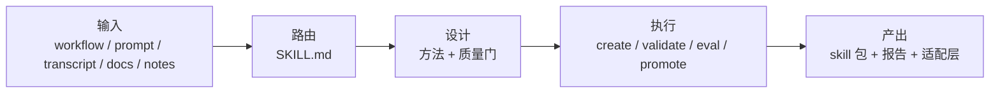

# Yao Meta Skill 中文介绍

`YAO = Yielding AI Outcomes`，中文可理解为：产出 AI 结果，交付真实成果。它强调的不是生成更多 prompt 文本，而是沉淀可复用的 AI 资产与可落地的实际结果。

`yao-meta-skill` 是一套轻量但严谨的系统，用来创建、评估、打包和治理可复用的 agent skill。

它把粗糙的 workflow、transcript、prompt、notes 和 runbook 转成可复用的 skill 包，并具备：

- 清晰的触发面
- 精简的 `SKILL.md`
- 可选的 references、scripts 和 evals
- 深度起草前先做一轮更有人味的意图对话，并通过 intent confidence gate 判断理解是否足够清楚；如果不够清楚，会继续补 1 到 2 个高杠杆问题
- 深度起草前会静默执行 GitHub benchmark scan 和 reference synthesis，优先学习高质量公开项目与世界级模式；只有遇到真实冲突或不确定性时才显式抬给用户
- 会主动询问用户是否有希望借鉴的参考对象，只学习其中的模式抽象、结构和标准，不复制原文或私密内容
- 新建 skill 时自动生成一份极简白底 HTML 可视化说明
- 提供 prompt quality profile，把需求模型、RTF 映射、复杂度和提示词质量检查沉淀成 reviewer 可见证据，而不是塞进 `SKILL.md`
- 首次建包后会自动给出 3 个最有价值的下一步迭代方向
- 提供一个紧凑的 HTML review viewer，方便第一次人工理解和评审
- 提供一个轻量 feedback log，不必每次都走完整 promotion 流程
- 提供一个 with-skill vs baseline 的对比报告，便于快速看增量收益
- 提供一个更像对话发现流程的 archetype-aware quickstart，引导新 skill 落到 scaffold、production、library 或 governed 的合适形态
- 中性的源元数据以及面向不同客户端的适配层
- 内建的治理、晋升和 portability 检查

## 架构图

Hero 版可以压缩成一条主线：把零散输入变成一个可治理、可复用的 skill 包。


```mermaid
flowchart LR
    A["输入<br/>workflow / prompt / transcript / docs / notes"] --> B["路由<br/>SKILL.md"]
    B --> C["设计<br/>方法 + 质量门"]
    C --> D["执行<br/>create / validate / eval / promote"]
    D --> E["产出<br/>skill 包 + 报告 + 适配层"]
```

10 秒理解这张图：

- **输入**：从零散的 workflow、prompt、文档和笔记出发。
- **路由**：先用精简的 `SKILL.md` 定义边界和触发。
- **设计**：选择合适的 archetype、gates 和资源拆分方式。
- **执行**：通过统一 CLI 完成创建、校验、优化和晋升。
- **产出**：最终得到 skill 包，以及评测、治理和 portability 证据。

## 加权质量评测

下面是当前项目采用的工程质量评测模型。每个维度按 `0-10` 评分，再按权重折算到 `100` 分。GitHub stars 不计入总分，因为它反映生态热度，不直接代表元 skill 工程质量。

这个分数是本地工程证据，不等同于 world-class ready。公开宣称“已证明优于其他方案”仍要以 world-class ledger 中已接受的外部证据和人工证据为准。

加权总分公式：`sum(单项评分 / 10 * 权重)`。

| 元 Skill | 方法论深度 15 | 上下文纪律 10 | 工具链 15 | Eval/测试 20 | 治理 15 | 可移植 10 | 上手/评审 5 | 本地可靠性 10 | 加权总分 |
| --- | ---: | ---: | ---: | ---: | ---: | ---: | ---: | ---: | ---: |
| Yao Meta Skill | 9.5 | 8.0 | 9.5 | 9.5 | 9.5 | 9.0 | 6.5 | 9.5 | 91.5 |
| Anthropic Skill Creator | 9.0 | 6.5 | 8.5 | 7.5 | 4.0 | 5.0 | 7.5 | 5.0 | 67.5 |
| OpenAI Skill Creator | 8.5 | 9.5 | 5.0 | 2.0 | 3.0 | 4.0 | 8.5 | 4.0 | 50.5 |

| 排名 | 元 Skill | 总分 | 核心定位 |
| ---: | --- | ---: | --- |
| 1 | Yao Meta Skill | 91.5 | 工程化、评测化、治理化、可移植的完整元 skill 系统。 |
| 2 | Anthropic Skill Creator | 67.5 | 方法论和迭代闭环强，但本地执行可靠性和治理覆盖较弱。 |
| 3 | OpenAI Skill Creator | 50.5 | 更适合作为精简 skill 写作方法论教材，而不是完整工程系统。 |

## 人工盲测快照

2026-06-29，一位人工评审者在 5 个真实常见的 skill 创建场景里，对比了 `yao-meta-skill` 和内置的 OpenAI `skill-creator`。5 个场景分别是客服工单分诊、月度收入对账、Webinar 内容复用、故障复盘和 PR Review 跟进。评审者确认：所有选择都在揭晓来源前完成。

结果：`yao-meta-skill` 在 `5/5` 个案例中胜出。

证据：

- 盲测入口：[reports/blind-human-review-2026-06-29/index.html](../reports/blind-human-review-2026-06-29/index.html)
- Adjudication 摘要：[reports/blind-human-review-2026-06-29/adjudication.md](../reports/blind-human-review-2026-06-29/adjudication.md)
- 已记录判断：[reports/blind-human-review-2026-06-29/review-decisions.recorded.json](../reports/blind-human-review-2026-06-29/review-decisions.recorded.json)

边界：这是单人盲测偏好证据，不是 provider-backed 的独立模型执行证据；每个案例的逐项理由仍为空。

## 适用场景

- 如果你要的是**团队复用、显式边界、质量门、治理、可移植性和长期维护**，更适合 `Yao Meta Skill`。
- 如果你要的是**对话优先的创作循环和人工引导式迭代**，更适合 `Anthropic Skill Creator`。
- 如果你要的是**精简的 skill 写作参考和上下文纪律示范**，更适合 `OpenAI Skill Creator`。
- 一个很实用的组合方式是：先用更对话式的系统做第一版，再用 `yao-meta-skill` 把它加固成团队可复用的正式资产。

## 快速开始

如果你想直接在 Codex 里使用这个 skill，先安装到全局 skills：

```bash
npx -y skills add yaojingang/yao-meta-skill -a codex -g -y
```

如果要安装到全部支持的 agent，把 `-a codex` 换成 `-a '*'`：

```bash
npx -y skills add yaojingang/yao-meta-skill -a '*' -g -y
```

安装完成后重启客户端，再用“创建 skill”“改进已有 skill”“评估 skill”“给 skill 增加 eval”这类任务触发 `yao-meta-skill`。

1. 先描述你想沉淀成 skill 的 workflow、prompt 集合或重复任务。
2. 先做一轮简短但更有人味的意图对话，把真实任务、输出物、边界、约束和你在意的质量标准说清楚。
3. 先让 `quickstart` 澄清意图，再静默跑 benchmark scan 和 reference synthesis；只有当意图还不清楚，或者设计路线真的冲突时，才会显式继续追问或让你拍板。
4. 使用 archetype-aware 的 `quickstart` 或完整作者流，在 scaffold、production、library 或 governed 模式下生成或改进 skill 包。
5. 新建 skill 后，会默认附带 `reports/intent-dialogue.md`、`reports/intent-confidence.md`、`reports/reference-synthesis.md`、`reports/artifact-design-profile.md`、`reports/prompt-quality-profile.md`、`reports/skill-overview.html`、`reports/review-viewer.html` 和 `reports/iteration-directions.md`；后续还可以通过 feedback log 和 baseline compare 快速收集意见、查看增量收益，而不必每次都走完整 promotion 流程。

## 当前结果

- 当前 `make test` 可通过
- 当前回归集下 trigger eval 为 `0` 误触发、`0` 漏触发
- train / dev / holdout 三层评测均通过
- 中文真实表达已经纳入触发评测，覆盖“做一个 skill”“沉淀成可复用能力”“优化已有 skill”“补 trigger 评测”等常见说法
- `openai`、`claude`、`generic` 三个目标的 packaging contract 校验通过
- 单人盲测快照中，评审者在揭晓来源前完成判断，并在 `5/5` 个真实 skill 创建场景中选择 `yao-meta-skill`；证据见 [reports/blind-human-review-2026-06-29/adjudication.md](../reports/blind-human-review-2026-06-29/adjudication.md)

## 当前优势

最新加权评测中，Yao 的总分是 `91.5/100`。最强的部分集中在团队级 skill 资产真正需要的能力上：

- **方法论深度 `9.5`**：已经形成正式的 skill engineering doctrine，覆盖 archetype、gate selection、non-skill decision、governance 和 resource boundary。
- **工具链完整度 `9.5`**：初始化、校验、benchmark scan、description optimization、报告、晋升检查、打包、CI 和 portability checks 已经串成一条完整工具链。
- **Eval / 测试严谨度 `9.5`**：触发评测覆盖 train/dev/holdout、blind holdout、adversarial holdout、judge-backed blind eval、route confusion、drift history 和 promotion gate。
- **治理 / 生命周期 `9.5`**：重要 skill 可以声明 owner、生命周期、review cadence、maturity score、trust boundary、promotion decision 和 regression history。
- **本地可执行可靠性 `9.5`**：可以通过 `make test`、`make ci-test` 和统一 CLI 在本地复验。
- **可移植 / 分发能力 `9.0`**：源码保持中性，adapter、degradation rule、packaging contract 和 portability score 负责保留跨环境可复用语义。
- **上下文纪律 / 精简度 `8.0`**：入口仍保持在预算内，但因为系统承载了更多报告、案例、benchmark 和证据资产，这一项被持续作为约束跟踪。
- **上手 / 评审体验 `6.5`**：quickstart、HTML overview、side-by-side review viewer 和 feedback log 已经改善首次体验，但仍是下一阶段最值得优化的 UX 维度。

整体方向很明确：入口尽量轻，评测尽量硬，治理显性化，同时继续降低首次创建和人工评审的摩擦。

## 为什么是 Yao

- **轻量**：入口保持紧凑，context budget 明确分层，只有在真正值得时才增加额外结构。
- **严谨**：trigger 质量会经过 family regression、blind holdout、adversarial holdout、route confusion、judge-backed blind eval 和 promotion gate 的联合检查。
- **可治理**：重要 skill 被当成可维护资产处理，具备 lifecycle、maturity expectation、owner 和 review cadence。
- **可移植**：源码元数据保持中性，adapter、degradation rule 和 packaging contract 负责保留跨环境可复用语义。

## 它能做什么

这个项目帮助你把 skill 从一次性 prompt，升级成可创建、可重构、可评估、可打包的长期能力包。

它的设计逻辑很简单：

1. 识别用户请求背后真正重复发生的工作
2. 划清 skill 边界，让一个包只做一个连贯的任务
3. 优先优化触发 description，而不是先把正文写长
4. 保持主 skill 文件精简，把细节移到 references 或 scripts
5. 只在值得时加入质量门槛
6. 只为真正需要的客户端导出兼容产物

## 为什么要做它

大多数团队的重要操作知识都散落在聊天记录、个人 prompt、口头习惯和未成文 workflow 中。这个项目的作用，是把这些隐性流程知识转成：

- 可发现的 skill 包
- 可重复的执行流程
- 更低上下文负担的指令
- 可复用的团队资产
- 可兼容分发的产物

## 仓库结构

```text
yao-meta-skill/
├── SKILL.md
├── README.md
├── LICENSE
├── .gitignore
├── agents/
│   └── interface.yaml
├── references/
├── scripts/
└── templates/
```

## 核心组成

### `SKILL.md`

主 skill 入口，定义触发面、工作模式、压缩后的工作流和输出契约。

### `agents/interface.yaml`

中性的元数据单一来源。它保存显示信息和兼容性信息，不把源码树锁定到某一家厂商的专属路径。

### `references/`

用于存放不应该塞进主 skill 文件的长文档，包括设计规则、评估方法、兼容策略和质量 rubric。

### `scripts/`

让这个元 skill 具备工程化能力的辅助脚本：

- `trigger_eval.py`：检查 trigger description 是否过宽或过弱
- `context_sizer.py`：估算上下文体积，并在初始加载过大时给出警告
- `cross_packager.py`：从中性的源码包生成客户端特定的导出产物

### `templates/`

用于生成简单 skill 和更复杂 skill 的起步模板。

## 如何使用

### 1. 直接使用这个 skill

当你想做以下事情时，可以调用 `yao-meta-skill`：

- 创建新 skill
- 改进已有 skill
- 给 skill 增加 eval
- 把 workflow 变成可复用包
- 为更广泛的团队使用准备 skill

### 2. 生成一个新的 skill 包

典型流程是：

1. 描述 workflow 或能力
2. 识别触发语句和目标输出
3. 选择 scaffold、production 或 library 模式
4. 生成 skill 包
5. 在需要时运行体积检查和触发检查
6. 导出面向目标客户端的兼容产物

### 3. 导出兼容产物

示例：

```bash
python3 scripts/cross_packager.py ./yao-meta-skill --platform openai --platform claude --zip
python3 scripts/context_sizer.py ./yao-meta-skill
python3 scripts/trigger_eval.py --description "Create and improve agent skills..." --cases ./cases.json
```

## 优势

- **方法论优先，不是 prompt 优先**：skill creation 被当成正式工程流程，而不是只写一段说明文字
- **天生面向触发优化**：description 会经过 route confusion、blind holdout、adversarial family 和 promotion policy 的检查
- **入口轻量**：`SKILL.md` 保持克制，references、scripts、evals 只在真正值得时加入
- **工具链完整**：初始化、校验、优化、报告、打包、测试，都能走统一 CLI 和 CI 路径
- **治理化资产**：重要 skill 可以带 owner、lifecycle、maturity expectation 和 review cadence
- **默认可移植**：源码中立，兼容性通过 adapter 和 degradation rule 处理
- **证据密度高**：route scorecard、regression history、context budget、portability score、promotion decision 都是公开产物，而不是隐藏实现

## 最适合谁

这个项目尤其适合：

- agent 构建者
- 内部工具团队
- 正在从 prompt engineering 转向 skill engineering 的人
- 想构建可复用 skill 库的组织

## 许可证

MIT。见 [LICENSE](../LICENSE)。
